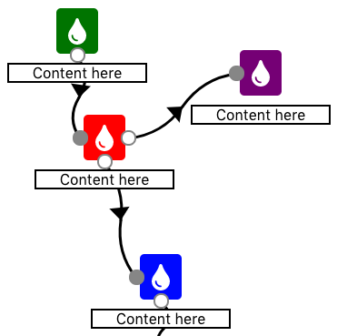

# Marketing Automation Tool UI

A work in progress front-end UI for an email marketing automation tool.

View <b>live</b> example Here: 

<a href="https://gifted-joliot-23ea50.netlify.com/">https://gifted-joliot-23ea50.netlify.com/</a>

<h2>Local Installation</h2>
<ul>
  <li>git clone https://github.com/logmannn/marketing-automation-tool-ui</li>
  <li>cd marketing-automation-tool-ui</li>
  <li>npm install</li>
  <li>npm start</li>
  <li>Go to <a href="http://localhost:3000/">http://localhost:3000/</a></li>
</ul>

<h2>Features</h2>
<ul>
  <li>Collapsable sidebar</li>
  <li>Draggable icons</li>
  <li>When at the edge of the screen while dragging an icon the page scrolls</li>
  <li>Connect email marketing steps by clicking the connector circles</li>
  <li>You can't place a line on a location that would create a loop</li>
</ul>

<h2>Upcoming Features</h2>
<ul>
  <li>Add Multli-Threading</li>
  <li>Hover states for when a click will be blocked</li>
  <li>More icons like a True/False icon</li>
  <li>Better Looking SVG connector (Think wavy with arrows pointing towards the next step)</li>
  <li>Animated connector on finalization that gets drawn using react mt svg lines</li>
  <li>Ability to delete Icons and Lines</li>
  <li>Lagless connectors on drag past screen using same method as is currently being used on icons</li>
  <li>Multi-Select using Shift/Alt and a selector</li>
  <li>Creatable steps from a seperate sidebar</li>
  <li>Mobile friendly (small screens)</li>
  <li>Zoom</li>
  <li>Mini Map</li>
  <li>Editable text</li>
  <li>How many users are on the step show up next to the icon</li>
<ul>
